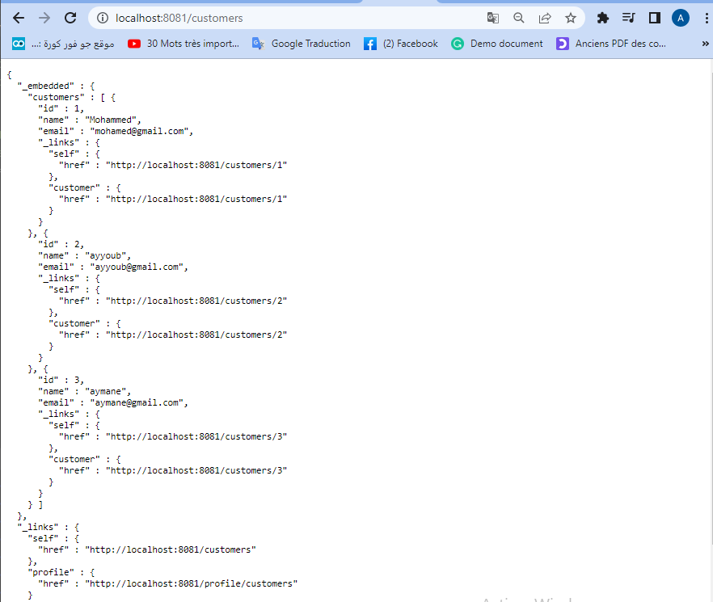
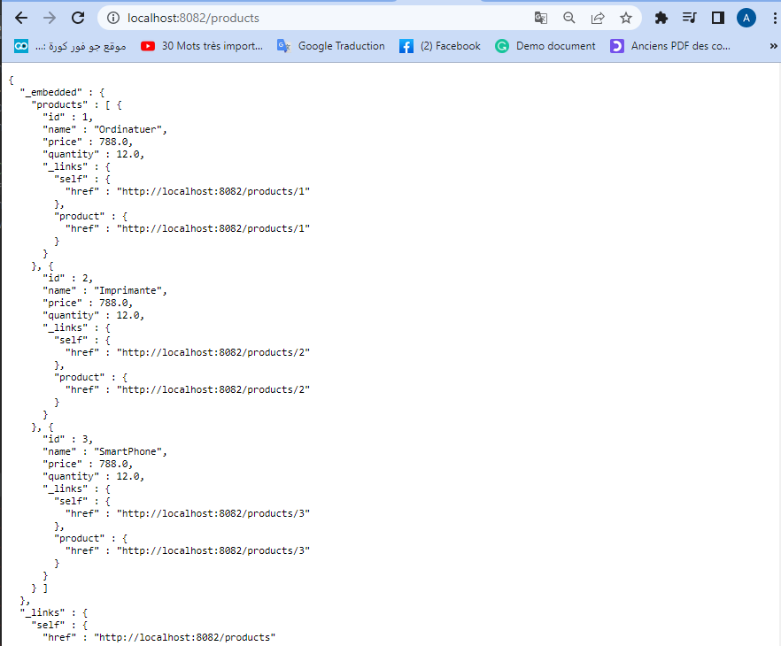
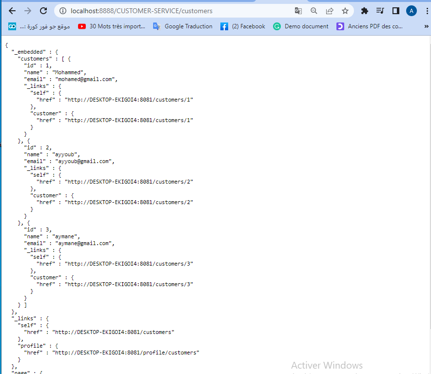

# Contrôle           
# Matière : JEE 
Nom complet : Ayyoub TELMOUDY
Nom complet : Ayyoub TELMOUDY
Filière : IIR Niveau : 5 
Groupe : G3 / 32

1) customer-service:
 Dans cet etap on crée un microservice qui va gérer les clients et on lui envoie des requêtes http à travers son adresse :
 

2) inventory-service:

 Dans cet etap on crée un microservice qui va gérer les produits et on va faire la même chose que l'étape précédent :
 
 
 
 3) Gateway Spring cloud :
    Gateway avec une Configuration statique du système de routage :
 
 

  le microservice customer-service à travers la gateway 

    

  le microservice inverntory-service à travers la gateway

    

 4) l'annuaire Eureka Discrovery Service :

   

 5) Configuration dynamique des routes de la gateway
